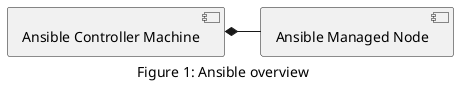

# Ansible Collection Skeleton

Collection template repository.

## Status

[](https://travis-ci.org/lordoftheflies/{{ role_name }})

## Template

*This* readme file should contain a the name and a short description/quick docs of the collection and an optional 
link to `docs/` for more complete documentation.

### Directory Structure

Current directory structure:

* `docs/`: local documentation for the collection
* `license.txt`: optional copy of license(s) for this collection
* `galaxy.yml`: source data for the `MANIFEST.json` that will be part of the collection package
* `playbooks/`: playbooks reside here tasks/: this holds 'task list files' for include_tasks/import_tasks usage
* `plugins/`: all ansible plugins and modules go here, each in its own subdir
* `modules/`: ansible modules
* `lookups/`: lookup plugins
* `filters/`: Jinja2 filter plugins
... rest of plugins
* `README.md` or `README.rst`: this file
* `roles/`: directory for ansible roles
* `tests/`: tests for the collection's content

### Make an instance

Perform the following changes.

1. [ ] Fill out metadata in `./galaxy.yml`.
1. [ ] Choose collection type (`roles`, `site`).
1. [ ] Push your changes to [GitHub](https://github.com)
1. [ ] Integration with [Travis-CI](https://travis-ci.org)
1. [ ] Provision supported platforms
1. [ ] Make a release
1. [ ] Build and publish collection to [Ansible Galaxy](https://galaxy.ansible.com)
1. [ ] Update documentation ([](#), [](#))

## Usage

### Requirements

Development environment:
* Vagrant: 2.2.7
* Kvm

Production environments:
* Ansible 2.9+
* Python 3.4+

### Dependencies

Setup roles:

```shell script
ansible-galaxy role install -r requirements.yml -p ./roles
```

Setup collections:

```shell script
ansible-galaxy collection install -r requirements.yml -p ./collections
```

### Playbooks

Install plays:

```shell script
ansible-playbook site.yml -K
```

Uninstall plays:

```shell script
ansible-playbook purge.yml -K
```

Backup plays:

```shell script
ansible-playbook backup.yml -K
```

Restore plays:

```shell script
ansible-playbook restore.yml -K
```

### Supported platforms

| OS | Version | Distribution | Supported [^1](#) | Results  |
| :--- | :---: | :---: | :---: | :---: |
| Ubuntu | 14.10 | [](#) | `RGB(0,255,0)` untested | [](#) |
| Ubuntu | 16.10 | [](#) | `RGB(0,255,0)` untested | [](#) |
| Ubuntu | 18.10 | [](#) | `RGB(0,255,0)` unstable | [](#) |
| Ubuntu | 19.04 | [](#) | `RGB(0,255,0)` unstable | [](#) |
| Ubuntu | 19.10 | [](#) | `RGB(0,255,0)` supported | [](#) |
| Debian | 7 | [](#) | `RGB(0,255,0)` supported | [](#) |
| CentOS | 7 | [](#) | `RGB(0,255,0)` supported | [](#) |
| CentOS | 8 | [](#) | `RGB(0,255,0)` supported | [](#) |
| Fedora | 8 | [](#) | `RGB(0,255,0)` unsupported | [](#) |
| RedHat | 8 | [](#) | `RGB(0,255,0)` unsupported | [](#) |
| ArchLinux | 8 | [](#) | `RGB(0,255,0)` unsupported | [](#) |
| Kali | 8 | [](#) | `RGB(0,255,0)` unsupported | [](#) |
| OpenSUSE | 8 | [](#) | `RGB(0,255,0)` unsupported | [](#) |
| MacOS | * | [](#) | `RGB(0,255,0)` unsupported | [](#) |
| Windows | * | [](#) | `RGB(0,255,0)` unsupported | [](#) |

### Variables

<p>
<details>
<summary>Service subdomain</summary>

These details <em>will</em> remain <strong>hidden</strong> until expanded.

<pre>
    <code>
infrastructure_domain: "cherubits.hu"
infrastructure_services:
    - subdomain: plantuml
    </code>
</pre>

> Results `infrastructure_host` will `plantuml.cherubits.hu`

</details>
</p>

## Prequisites

### Ansible Setup



#### On Each Remote Machine

Add a new technical user for Ansible:
```shell script
adduser ansible
```

#### On Controller Machine

Generate SSH key pair on Ansible Controller Machine:

```shell script
ssh-add -t rsa -C $(git config user.email)
eval `ssh-agent -s`
ssh-add ~/.ssh/id_rsa
ssh-copy-id -i ~/.ssh/id_rsa
```

## Author(s)

- [László Hegedűs](mailto:laszlo.hegedus@cherubits.hu)

[^1]: {{ role_name }} generated using [galaxy-role-skeleton](https://github.com/lordoftheflies/ansible_collection_skeleton)